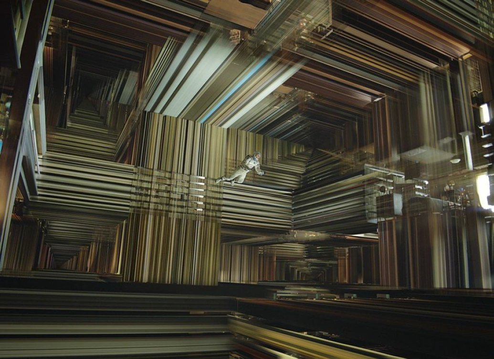
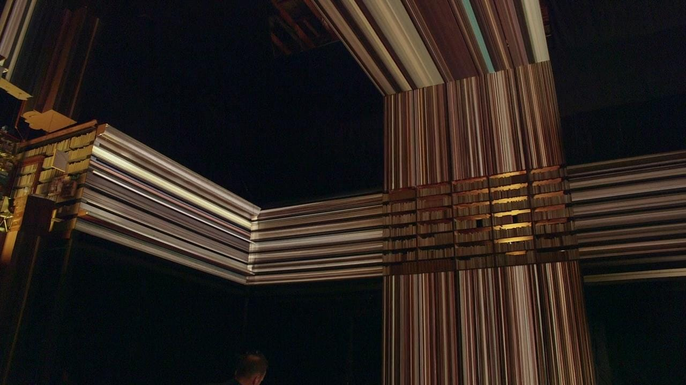
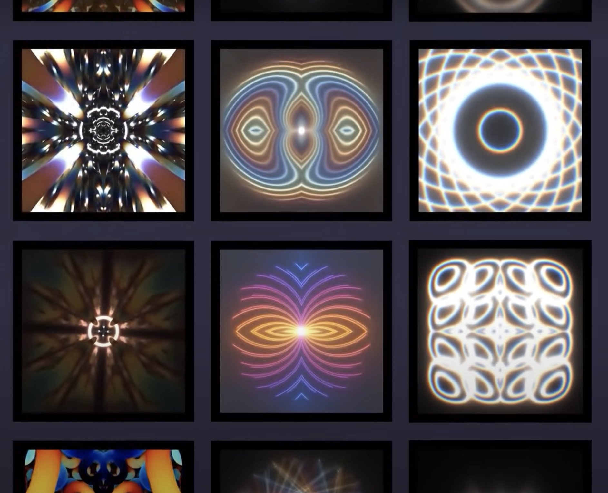

# rzha0907_quiz_8

## Part 1: Imaging Technique Inspiration

In the *Interstellar* movie, the Tesseract scene stands out for its complex interplay of slit-scan photography technique. It represents a vast, seemingly infinite library that extends space and time across multiple dimensions. Inspired by this, our project can explores slit-scan photography to create multidimensional and abstract artwork.

> With slit-scan, you allow the image to move past a slit-shaped shutter held open for longer-than-normal exposures -- Paul Franklin

### Approach

- **Slit-scan Photography Techniques**: Utilize slit-scan photography for rendering the more unnatural and fantastical elements that involve complex geometrical distortions and multi-dimensional visualizations.

- **Modular Classes**: Implement classes that represent different layers or "slices" of time and space. Each class will manage aspects of the rendering, including movement and interaction. This modular approach aids in keeping the codebase clean and maintainable.

## Part 2: Coding Technique Exploration

To replicate the sophisticated visual effects seen in the Tesseract scene, we will leverage the OpenGL Shading Language (GLSL). GLSL allows for the creation of custom shader programs that can process pixels and vertices very efficiently.

### Key Techniques

- **Vertex Shaders**: Modify the spatial coordinates of vertices dynamically, allowing for the simulation of complex geometric structures as viewed from different perspectives.

- **Fragment Shaders**: Adjust pixel colors based on the viewer’s perspective and desired effects, such as lighting and refraction, to enhance the four-dimensional appearance.

#### GLSL Example

[a link to some example code](https://www.shadertoy.com/view/XfcGR2)
